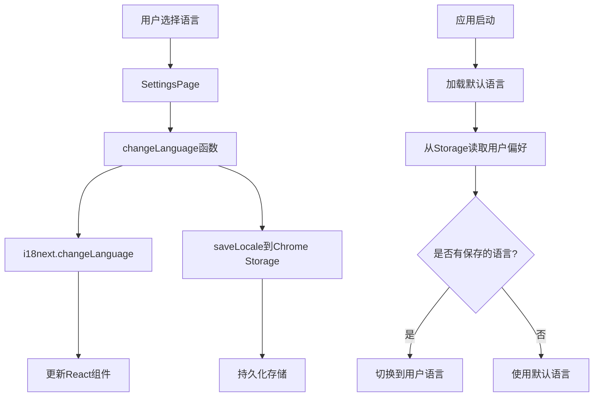

# 国际化 (i18n) 方案文档

## 概述

本项目采用基于 `react-i18next` 和 `i18next` 的国际化方案，实现了统一配置中心的设计模式，使得添加新语言支持变得简单高效。所有用户界面文本均已国际化，支持动态语言切换，用户偏好持久化存储。

## 功能特性

### 核心功能

- **多语言支持**：支持多种语言的界面显示
- **动态切换**：用户可在设置页面实时切换语言，无需刷新页面
- **持久化存储**：用户选择的语言偏好保存在 Chrome 本地存储中
- **类型安全**：完整的 TypeScript 类型支持，编译时检查翻译键
- **统一配置**：单一配置源，添加新语言只需修改一个文件
- **自动同步**：类型、选项列表等自动更新，无需手动维护

### 当前支持的语言

- **中文 (简体)** (`zh-CN`) - 默认语言

## 架构设计

### 目录结构

```
src/i18n/
├── config.ts              # i18n 初始化配置
├── locales.ts             # 统一语言配置中心（核心配置文件）
└── locales/
    └── zh-CN/
        └── translation.json  # 中文翻译文件
```

### 核心文件说明

#### 1. `src/i18n/locales.ts` - 统一配置中心

这是整个 i18n 系统的核心配置文件，定义了所有支持的语言及其元数据。

```typescript
export const SUPPORTED_LOCALES = {
  'zh-CN': {
    code: 'zh-CN',
    name: '中文 (简体)',
    nativeName: '中文 (简体)',
  },
} as const;

export type Locale = keyof typeof SUPPORTED_LOCALES;
export const DEFAULT_LOCALE: Locale = 'zh-CN';
export const LOCALE_CODES = Object.keys(SUPPORTED_LOCALES) as Locale[];
```

**优势**：
- 单一配置源：所有语言配置集中管理
- 类型自动生成：`Locale` 类型自动从配置推导
- 易于扩展：添加新语言只需在此文件添加一项

#### 2. `src/i18n/config.ts` - i18n 初始化

负责初始化 i18next 和 react-i18next，处理语言切换逻辑。

**关键功能**：
- 同步初始化默认语言，确保应用启动时正常显示
- 异步加载用户语言偏好
- 提供 `changeLanguage` 函数用于切换语言

#### 3. `src/i18n/locales/{locale}/translation.json` - 翻译文件

每个语言对应一个 JSON 文件，包含所有翻译键值对。

**翻译键结构**：
翻译键采用分层命名空间结构，按功能模块组织：

```json
{
  "app": {
    "title": "CrossTag Bookmarks",
    "name": "CrossTag Bookmarks"
  },
  "common": {
    "save": "保存",
    "cancel": "取消",
    "delete": "删除"
  },
  "bookmark": {
    "title": "书签",
    "new": "新建书签",
    "edit": "编辑书签"
  }
}
```

### 数据流



## 实现方案

### 1. 统一配置中心模式

采用"单一配置源"设计模式，所有语言相关配置集中在 `locales.ts` 文件中：

- **语言定义**：`SUPPORTED_LOCALES` 对象
- **类型定义**：`Locale` 类型自动生成
- **工具函数**：`getLocaleName()`, `getLocaleNativeName()` 等

### 2. 类型安全

通过 TypeScript 的类型推导，确保：

- 语言代码的类型安全
- 编译时检查翻译键的存在
- 自动补全支持

### 3. 持久化存储

使用 Chrome Extension 的 `chrome.storage.local` API 存储用户语言偏好：

- 键名：`tbm.locale`
- 默认值：`DEFAULT_LOCALE` (zh-CN)
- 存储位置：`src/lib/storage.ts`

### 4. 组件集成

所有 React 组件通过 `useTranslation` Hook 使用翻译：

```typescript
import { useTranslation } from 'react-i18next';

export const MyComponent = () => {
  const { t } = useTranslation();
  
  return (
    <div>
      <h1>{t('app.title')}</h1>
      <button>{t('common.save')}</button>
    </div>
  );
};
```

### 5. 根组件包装

在应用入口处使用 `I18nextProvider` 包装根组件：

```typescript
// src/pages/options/main.tsx
import { I18nextProvider } from 'react-i18next';
import i18n from '../../i18n/config';

ReactDOM.createRoot(document.getElementById('root')!).render(
  <React.StrictMode>
    <I18nextProvider i18n={i18n}>
      <OptionsApp />
    </I18nextProvider>
  </React.StrictMode>
);
```

## 使用指南

### 在组件中使用翻译

#### 基本用法

```typescript
import { useTranslation } from 'react-i18next';

const MyComponent = () => {
  const { t } = useTranslation();
  
  return <div>{t('bookmark.title')}</div>;
};
```

#### 带参数的翻译

```typescript
// translation.json
{
  "pagination": {
    "page": "第 {{page}} 页",
    "of": "共 {{total}} 页"
  }
}

// 组件中
const { t } = useTranslation();
t('pagination.page', { page: 1 });
t('pagination.of', { total: 10 });
```

#### 在非组件代码中使用

```typescript
import i18n from '../i18n/config';

// 直接使用 i18n 实例
const message = i18n.t('common.save');
```

### 语言切换

#### 在设置页面切换语言

设置页面自动从 `SUPPORTED_LOCALES` 生成语言选项列表：

```typescript
import { SUPPORTED_LOCALES, LOCALE_CODES, type Locale } from '../../../i18n/locales';

<select
  value={currentLocale}
  onChange={(e) => void handleLocaleChange(e.target.value as Locale)}
>
  {LOCALE_CODES.map((locale) => (
    <option key={locale} value={locale}>
      {SUPPORTED_LOCALES[locale].name}
    </option>
  ))}
</select>
```

#### 编程式切换语言

```typescript
import { changeLanguage } from '../i18n/config';

await changeLanguage('en-US');
```

## 添加新语言支持

### 步骤 1：更新语言配置

在 `src/i18n/locales.ts` 中添加新语言：

```typescript
export const SUPPORTED_LOCALES = {
  'zh-CN': {
    code: 'zh-CN',
    name: '中文 (简体)',
    nativeName: '中文 (简体)',
  },
  'en-US': {  // 新增
    code: 'en-US',
    name: 'English (US)',
    nativeName: 'English',
  },
} as const;
```

### 步骤 2：创建翻译文件

创建 `src/i18n/locales/en-US/translation.json`，复制 `zh-CN/translation.json` 的内容并翻译所有值。

### 步骤 3：注册翻译文件

在 `src/i18n/config.ts` 中导入并注册新语言的翻译：

```typescript
import zhCNTranslations from './locales/zh-CN/translation.json';
import enUSTranslations from './locales/en-US/translation.json'; // 新增

i18n.init({
  resources: {
    [DEFAULT_LOCALE]: {
      translation: zhCNTranslations,
    },
    'en-US': {  // 新增
      translation: enUSTranslations,
    },
  },
  // ...
});
```

### 步骤 4：验证

- 运行 `npm run build` 确保构建成功
- 检查 TypeScript 类型检查：`npx tsc --noEmit`
- 在设置页面测试语言切换功能

**注意**：步骤 1 完成后，类型、选项列表等会自动更新，无需手动修改其他文件。

## 翻译键命名规范

### 命名空间结构

翻译键采用分层命名空间，按功能模块组织：

```
{模块}.{子模块}.{具体键}
```

### 示例

```
app.title                    # 应用标题
common.save                  # 通用保存按钮
bookmark.title              # 书签模块标题
bookmark.new                # 新建书签
bookmark.edit               # 编辑书签
settings.language.title     # 设置-语言-标题
settings.language.zh-CN     # 设置-语言-中文选项
```

### 命名原则

1. **使用小写字母和点号分隔**
2. **按功能模块分组**：`bookmark`, `tag`, `workstation`, `settings` 等
3. **保持一致性**：相同功能的键使用相同的前缀
4. **语义清晰**：键名应该能清楚表达其用途

## 技术细节

### 依赖库

- **i18next**: 核心国际化框架
- **react-i18next**: React 集成库

### 初始化流程

1. **同步初始化**：使用默认语言（zh-CN）同步初始化，确保应用启动时正常显示
2. **异步加载偏好**：从 Chrome Storage 异步读取用户保存的语言偏好
3. **动态切换**：如果用户偏好与默认语言不同，动态切换到用户语言

### 性能优化

- **同步加载默认语言**：确保首屏渲染时语言正确
- **按需加载**：其他语言在需要时加载
- **缓存机制**：i18next 内置翻译缓存

### 类型安全

- `Locale` 类型自动从 `SUPPORTED_LOCALES` 推导
- 编译时检查语言代码的有效性
- TypeScript 提供翻译键的自动补全（需要配置）

## 已知限制

### Background Script

由于 Chrome Extension 的 Background Service Worker 环境限制，`react-i18next` 无法在 background script 中使用（缺少 DOM 环境）。

**当前方案**：
- Background script 中的文本保持英文或使用硬编码中文
- 未来可考虑使用 Chrome 原生的 `chrome.i18n` API（需要创建 `_locales` 目录）

### 动态导入

当前实现使用同步导入翻译文件。如果未来需要支持大量语言，可以考虑：

- 使用动态导入（`import()`）按需加载
- 实现语言包的懒加载机制

## 最佳实践

### 1. 翻译键管理

- 保持翻译键的层次结构清晰
- 避免键名过长或过短
- 使用有意义的命名空间

### 2. 翻译内容

- 保持翻译的准确性和一致性
- 注意不同语言的文本长度差异（UI 布局）
- 考虑文化差异和本地化需求

### 3. 代码组织

- 所有翻译键定义在对应的 `translation.json` 文件中
- 避免在代码中硬编码文本
- 使用 `t()` 函数获取翻译，而不是直接访问翻译对象

### 4. 测试

- 测试所有语言下的界面显示
- 验证语言切换功能
- 检查翻译完整性（确保所有键都有翻译）

## 维护指南

### 添加新的翻译键

1. 在 `src/i18n/locales/zh-CN/translation.json` 中添加新键
2. 在所有其他语言的翻译文件中添加对应翻译
3. 在代码中使用 `t('namespace.key')` 引用

### 修改翻译内容

直接修改对应语言的 `translation.json` 文件即可，无需修改代码。

### 删除翻译键

1. 从所有语言的 `translation.json` 中删除该键
2. 从代码中移除对该键的引用

## 相关文件

- `src/i18n/locales.ts` - 统一语言配置中心
- `src/i18n/config.ts` - i18n 初始化配置
- `src/i18n/locales/zh-CN/translation.json` - 中文翻译文件
- `src/lib/storage.ts` - 语言偏好存储
- `src/pages/options/pages/SettingsPage.tsx` - 语言选择界面

## 总结

本项目的 i18n 方案采用统一配置中心的设计模式，实现了：

- ✅ **简单易用**：添加新语言只需修改一个配置文件
- ✅ **类型安全**：完整的 TypeScript 类型支持
- ✅ **自动同步**：类型、选项列表等自动更新
- ✅ **易于维护**：单一配置源，减少重复代码
- ✅ **向后兼容**：保持现有功能不变

该方案为项目提供了强大而灵活的多语言支持能力，为未来的国际化扩展奠定了良好的基础。
