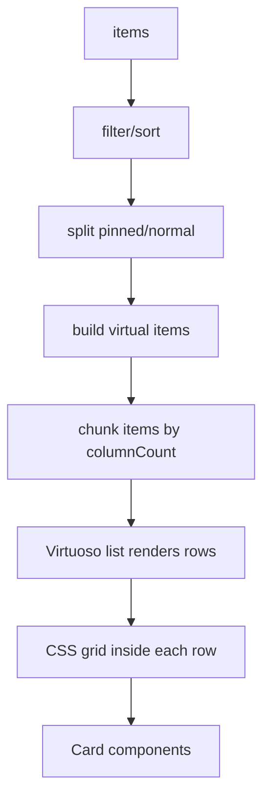

# Options 列表虚拟化（Virtualized Lists）技术说明

## 概述

本项目在 Options 管理页中，对 Bookmarks/Tags 等大数据量列表引入“虚拟化网格列表”方案：只渲染可视区域附近的列表项，显著降低 DOM 数量与重排开销，同时保持既有的主内容区滚动体验（滚动发生在内容容器内，而非整个页面）。

该方案的设计标准已沉淀在：`.cursor/rules/design-guide.mdc` 的“列表设计标准”章节。

## 功能特性

- **大列表性能**：上百～上千条数据滚动更流畅（减少一次性渲染的卡顿）。
- **按行虚拟化（row virtualization）**：以“行”为单位进行虚拟化，行内使用 CSS Grid 排列卡片，便于插入分隔标题行（pinned/normal）。
- **主区域滚动不变**：虚拟化组件接管既有滚动容器（custom scroll parent），避免顶栏/侧栏抖动。
- **回到顶部**：主滚动区超过阈值显示悬浮按钮，支持平滑回顶。
- **两种响应式列数策略**：
  - 默认：断点范围 + 卡片宽度约束（适用于信息密度高的书签卡片）
  - 可选（opt-in）：固定统一卡片宽度推导列数（适用于标签等信息密度较低的卡片）

## 架构设计

### 目录结构（相关文件）

```
src/pages/options/pages/
├── BookmarksPage.tsx
├── TagsPage.tsx
├── bookmarksPage.css
└── tagsPage.css
```

### 数据流（按行虚拟化）



## 关键实现

### 1) 按行虚拟化（row virtualization）

- 计算列数 `columnCount`
- 将数据按 `columnCount` 分组为 `rows`
- 虚拟化组件渲染 `rows`，行内用 grid 排列卡片
- 分隔标题（pinned/normal）作为“虚拟项”插入，保证滚动一致性

实现位置：
- `src/pages/options/pages/BookmarksPage.tsx`
- `src/pages/options/pages/TagsPage.tsx`

### 2) 接管主滚动容器（custom scroll parent）

目标：滚动仍发生在 `.bookmarks-content` / `.tags-content`，而非页面整体。

实现要点：
- 页面内容区保留 `overflow-y: auto`
- 虚拟化组件通过 `customScrollParent` 使用该容器作为滚动父级

对应样式：
- `src/pages/options/pages/bookmarksPage.css`
- `src/pages/options/pages/tagsPage.css`

### 3) 回到顶部（Back to top）

- 监听滚动容器的 `scrollTop`
- 超过阈值显示悬浮按钮
- 点击后优先调用虚拟化组件 `scrollToIndex({ index: 0, behavior: 'smooth' })`
- 并对滚动容器 `scrollTo({ top: 0, behavior: 'smooth' })` 做兜底

### 4) 响应式列数策略

#### 默认策略：断点范围 + 卡片宽度约束（Bookmarks）

先按容器宽度划分列数范围（例如 3–4 / 4–5），再用“最小宽度/目标最大可读宽度”在范围内选择列数，并在超大尺寸下取消 `max-width`，避免视觉间距变大。

#### 可选策略（opt-in）：固定卡片宽度推导列数（Tags）

在需要“列数完全由卡片宽度决定”的场景，使用固定 `cardWidth` 推导列数：

\[
cols = \\max\\left(1, \\left\\lfloor\\frac{containerWidth + gap}{cardWidth + gap}\\right\\rfloor\\right)
\]

并用 `grid-template-columns: repeat(cols, cardWidth)` + `justify-content: start` 保证剩余空间在右侧。

## 扩展方式

- 若新增更多列表页（例如 Workstations）需要虚拟化：
  - 复用“按行虚拟化”模式与滚动容器接管
  - 依据卡片信息密度选择默认/opt-in 的列数策略
  - 同步补齐回到顶部按钮与底部安全间距

## 相关文件

- 设计标准：`.cursor/rules/design-guide.mdc`（列表设计标准）
- Bookmarks：`src/pages/options/pages/BookmarksPage.tsx`、`src/pages/options/pages/bookmarksPage.css`
- Tags：`src/pages/options/pages/TagsPage.tsx`、`src/pages/options/pages/tagsPage.css`
